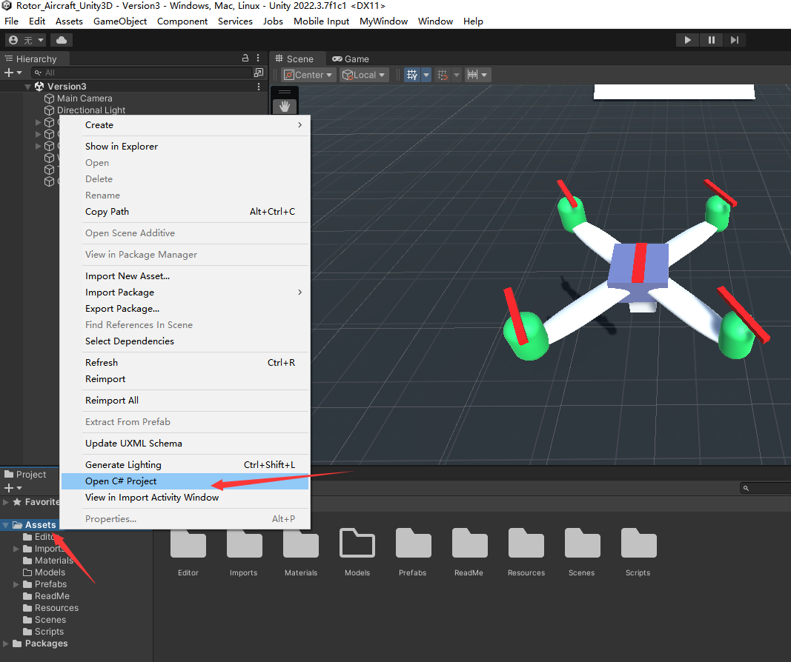
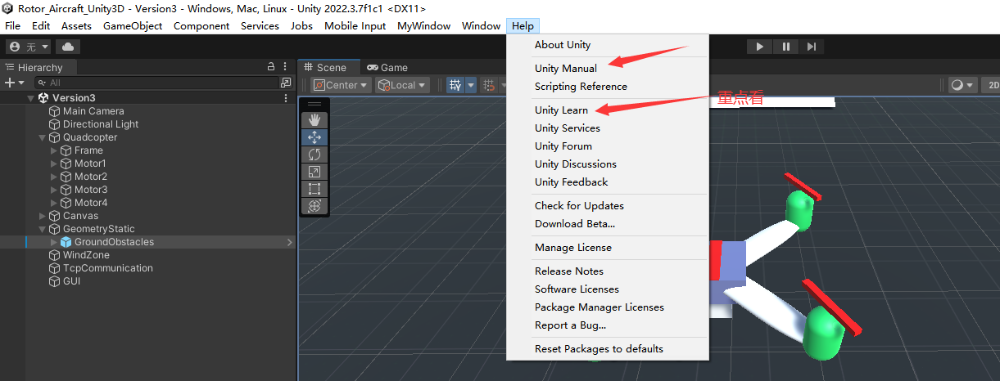
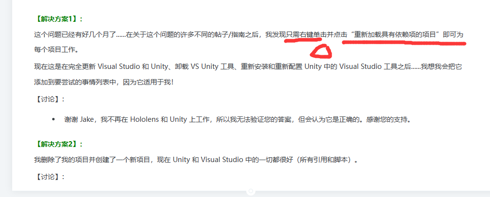

视频链接：[https://www.bilibili.com/video/BV1Fq4y1t7FA/?spm_id_from=333.999.0.0&vd_source=3bf4271e80f39cfee030114782480463](https://www.bilibili.com/video/BV1Fq4y1t7FA/?spm_id_from=333.999.0.0&vd_source=3bf4271e80f39cfee030114782480463)

# 运行环境

Qt：MinGW 6.5.2 64bit

Unity3D：2022.3.7f1c1

# 编辑

参考[https://github.com/laoxue888/Racing_Car](https://github.com/laoxue888/Racing_Car)导入Unity项目。

右键打开C#项目，编辑代码

# 学习资料

[C# 菜鸟教程](https://www.runoob.com/csharp/csharp-tutorial.html)

[Unity C#调试](https://docs.unity3d.com/cn/2019.4/Manual/ManagedCodeDebugging.html)

# Bugs

## [Unity with Visual Studio 2019 : Assembly-CSharp (incompatible) in Solution ExplorerUnity 与 Visual Studio 2019：解决方案资源管理器中的 Assembly-CSharp（不兼容）](https://www.likecs.com/ask-769012.html)

